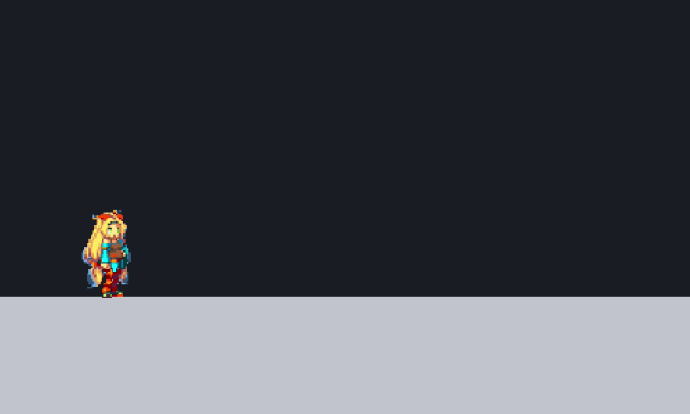
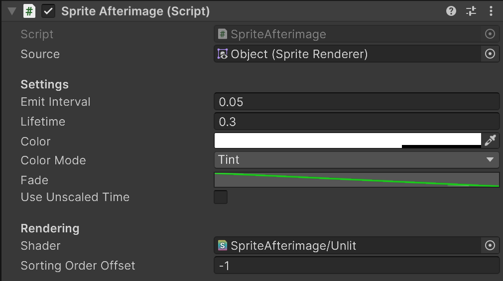

# SpriteAfterimage

High-performance afterimage effect for Unity 2D using GPU instancing

[](LICENSE)
[]()

[English](README.md) | 日本語



SpriteAfterimageはUnityのSpriteRendererの残像を描画するコンポーネントを提供するライブラリです。

Unity 6.5の`Graphics.RenderSpriteInstanced`を利用し、残像ごとにGameObjectやSpriteRendererを生成することなくGPUインスタンシングでまとめて描画することで高いパフォーマンスの残像表現を実現します。

## セットアップ

### 要件

- Unity 6.5以降
- Universal Render Pipeline（URP）

### インストール

1. Window > Package ManagerからPackage Managerを開く
2. 「+」ボタン > Add package from git URL
3. 以下のURLを入力する

```
https://github.com/nuskey8/SpriteAfterimage.git?path=Assets/SpriteAfterimage
```

あるいはPackages/manifest.jsonを開き、dependenciesブロックに以下を追記

```json
{
    "dependencies": {
        "com.nuskey8.spriteafterimage": "https://github.com/nuskey8/SpriteAfterimage.git?path=Assets/SpriteAfterimage"
    }
}
```

## クイックスタート

1. 残像を表示したいGameObjectへ`SpriteAfterimage`コンポーネントを追加します。
2. `Source`へ対象の`SpriteRenderer`を指定します。同じGameObjectに追加した場合は、コンポーネント追加時に自動設定されます。
3. `Shader`へ用途に応じたシェーダーを指定します。
   - `SpriteAfterimage/Unlit`: 2D Lightの影響を受けない残像
   - `SpriteAfterimage/Lit`: URP 2D Lightの影響を受ける残像
4. `Emit Interval`、`Lifetime`、`Color`などを調整します。

## 設定項目



| 項目                   | 説明                                                                      |
| ---------------------- | ------------------------------------------------------------------------- |
| `Source`               | 残像の記録元となるSpriteRenderer                                          |
| `Emission Enabled`     | 新しい残像を生成するかどうか                                              |
| `Emit Interval`        | 残像を記録する間隔（秒）                                                  |
| `Lifetime`             | 各残像が表示される時間（秒）                                              |
| `Color`                | 残像の色                                                                  |
| `Color Mode`           | `Tint`: 元Spriteの色へ`Color`を乗算 <br> `Solid`: `Color`一色で塗りつぶす |
| `Fade`                 | 残像の経過時間に対するalpha値                                             |
| `Use Unscaled Time`    | 有効にすると`Time.timeScale`の影響を受けない                              |
| `Shader`               | 残像の描画に使用するShader                                                |
| `Sorting Order Offset` | 元SpriteRendererのSorting Orderへ加算する値                               |

## GPUインスタンシング

デフォルトではSpriteAfterimageは同じSpriteの残像を`Graphics.RenderSpriteInstanced`で描画しますが、実行環境がGPUインスタンシングに非対応の場合は`Graphics.RenderSprite`で1枚ずつ描画します。これらの環境でパフォーマンスが問題になる場合は残像の数を少なく抑えることを推奨します。

## ライセンス

[MIT](LICENSE)

デモのユニティちゃんのアセットは[ユニティちゃんライセンス条項](https://unity3d.jp/unity-chan/license?lang=ja)の元に提供されています。


